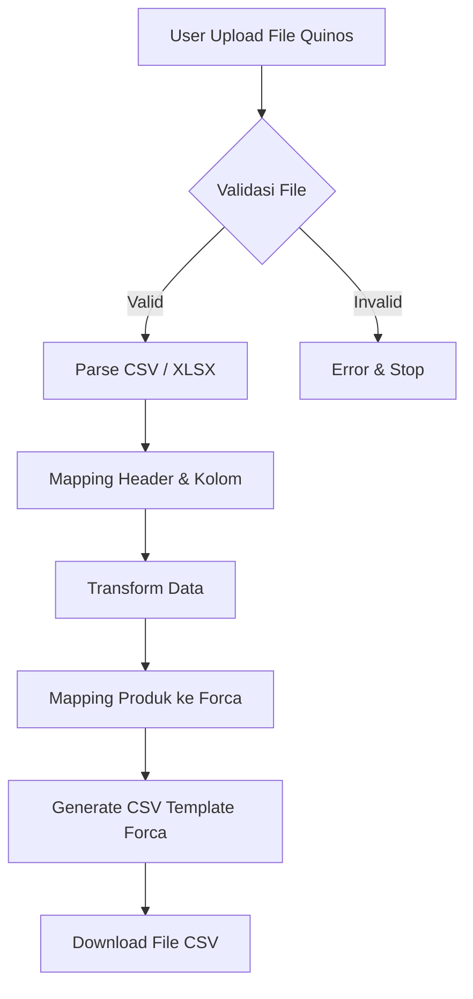
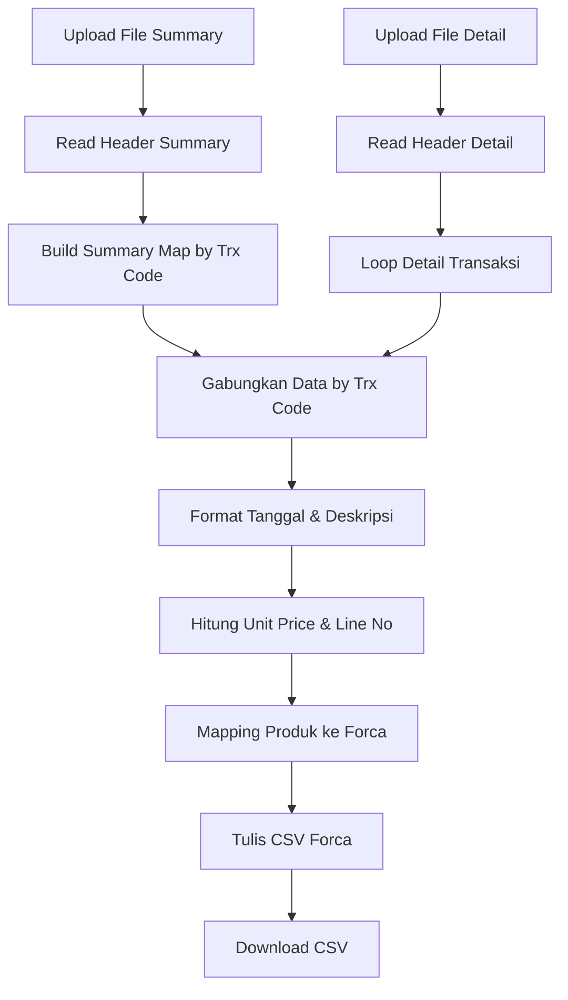
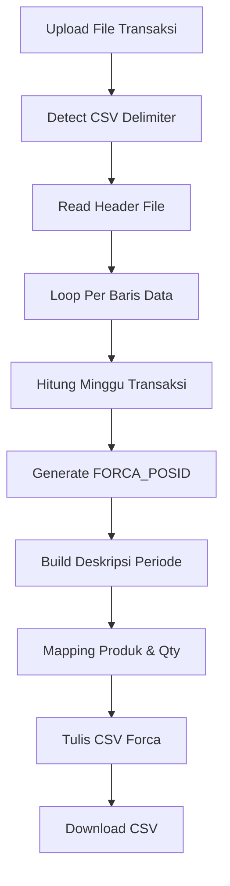

# 🧾 Quinos to Forca Sales Converter  
## Kopi Kilen

Aplikasi berbasis **Laravel** untuk mengonversi dan mengekspor data penjualan dari sistem **Quinos** agar sesuai dengan **template import Sales POS Forca**.

Tools ini digunakan untuk kebutuhan **migrasi, pelaporan, dan konsolidasi data penjualan Kopi Kilen**, sehingga data dapat langsung diimpor ke Forca tanpa pengolahan manual.

🌐 **Akses Website:**  
http://saleskopikilen.my.id/

---

## ✨ Fitur Utama

- ✅ Konversi data penjualan Quinos ke format CSV Forca
- ✅ Validasi otomatis struktur & header file
- ✅ Mapping produk Quinos → Master Produk Forca
- ✅ Transformasi tanggal, diskon, service charge, dan rounding
- ✅ Output CSV siap import
- ✅ Mendukung multiple lokasi outlet

---

## 🏪 Lokasi yang Didukung

| Lokasi | Tipe Input | Controller |
|------|-----------|-----------|
| Gusi | 2 File (Detail + Summary) | `QuinosConverterController` |
| South Quarter Jakarta | 2 File (Detail + Summary) | `QuinosConverterController` |
| Lantai 12 | 1 File (CSV / XLSX) | `QuinosConverterLantai12Controller` |

---

## 🔄 Diagram Flow Proses

### 1️⃣ Flow Umum Sistem

---

### 2️⃣ Flow Gusi & South Quarter Jakarta  
(**2 File: Detail + Summary**)

---

### 3️⃣ Flow Lantai 12  
(**1 File Transaksi**)

---

## 📂 Struktur Input File

### 🔹 Gusi & South Quarter Jakarta

**File Detail**
- Trx Code
- Name
- Qty
- Price

**File Summary**
- Trx Code
- Date
- Discount
- Service charge
- Rounding
- Customer (opsional)

---

### 🔹 Lantai 12

**File Transaksi**
- Tanggal Awal
- Tanggal Akhir
- Produk
- Qty
- Unit Price
- total_discount
- ServiceCharge

---

## 📤 Output File

- Format: **CSV**
- Struktur: **Template Import Sales POS Forca**
- Sudah mencakup:
  - Header transaksi
  - Detail line transaksi
  - Diskon & service charge
  - Pajak PB1 10%

---

## ⚙️ Teknologi

- Laravel
- PHP CSV Handling
- Date & Time Processing

---

## 👨‍💻 Internal Use

Digunakan oleh tim **Finance & IT Kopi Kilen**
